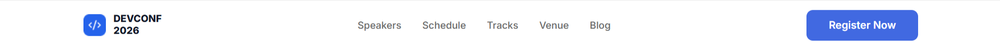
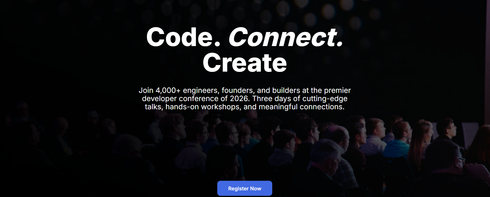
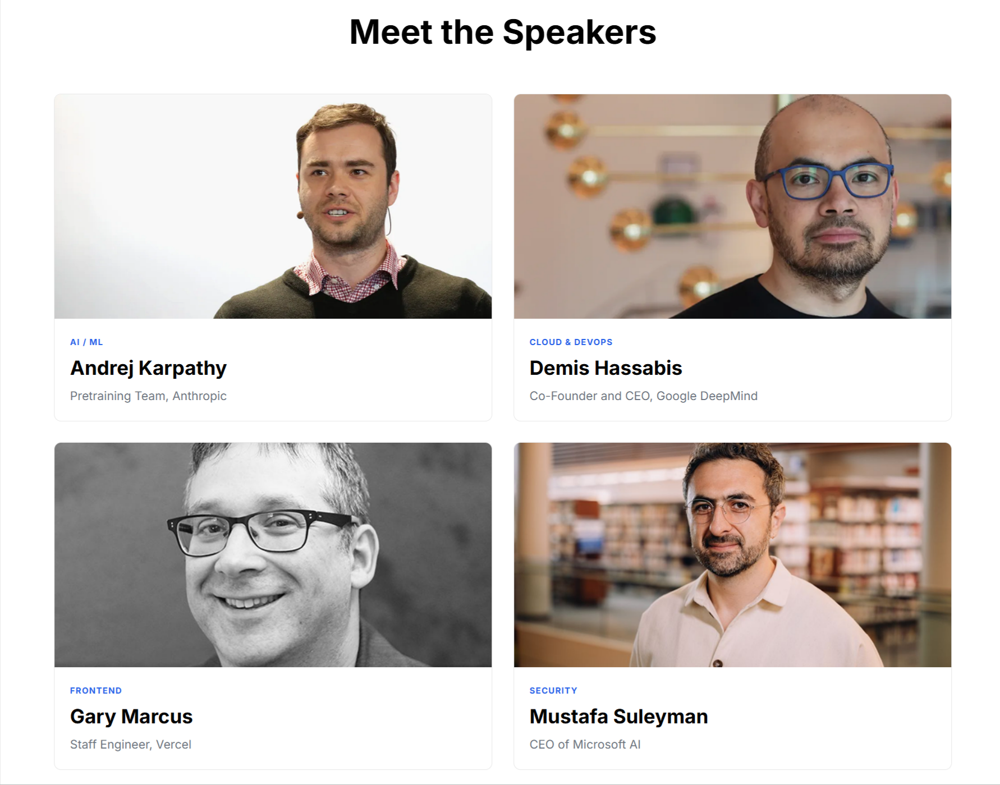
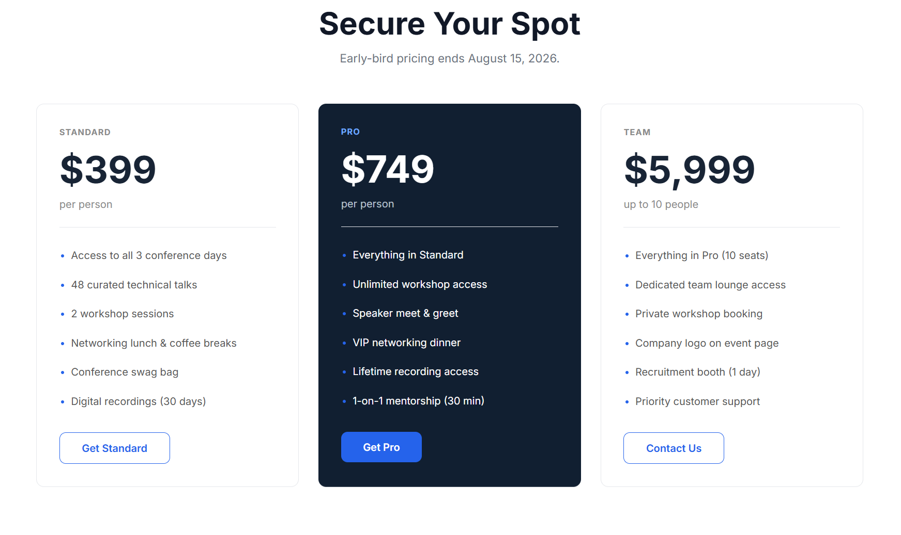
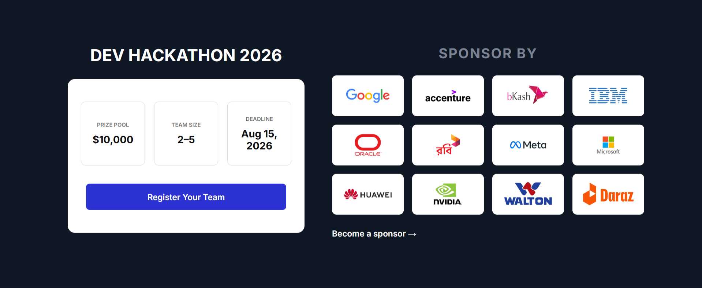
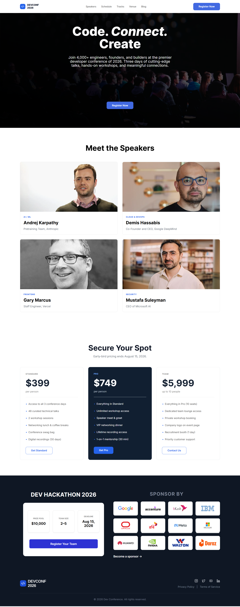

# DevConf 2026 - Conference Landing Page

**DevConf 2026** is a fictional technology conference landing page designed for developers, engineers, founders, and tech enthusiasts.

The goal of this project was to practice building a complete multi-section landing page from scratch while improving HTML and CSS fundamentals.

# Features

- Responsive Navigation Bar
- Full-width Hero Banner
- CTA (Call To Action) Button
- Speakers Section
- Pricing Cards
- Responsive Layout
- Flexbox Layouts
- CSS Grid
- Hover Effects
- Clean Typography
- Modern UI Design

# Technologies Used

- HTML5
- CSS3
- Google Fonts
- Flexbox
- CSS Grid


# 📷 Project Sections

# 1. Navigation Bar

> Screenshot: `./Preview/navbar.png`



### Description

The navigation bar was designed with simplicity and usability in mind.

Features include:

- Conference logo
- Navigation links
- Register button
- Flexbox alignment
- Maximum width container
- Clean spacing and typography


# 2. Hero Section

> Screenshot: `./Preview/hero-section.png`



### Description

The hero section serves as the main introduction of the conference.

Features include:

- Full-width background image
- Large conference headline
- Supporting description
- Centered content
- Primary "Register Now" button
- Proper content positioning over the background image

During development we adjusted:

- Text alignment
- Button positioning
- Hero spacing
- Background image placement
- Responsive layout

# 3. Speakers Section

> Screenshot: `./Preview/Speaker.png`



### Description

This section introduces featured conference speakers using responsive cards.

Each speaker card contains:

- Speaker image
- Category label
- Name
- Position
- Organization

CSS techniques used:

- CSS Grid
- Card layout
- Image sizing
- Border radius
- Spacing
- Typography hierarchy


# 4. Pricing Section

> Screenshot: `./Preview/Pricing.png`



### Description

Three pricing plans are presented in responsive pricing cards.

Plans include:

- Standard
- Pro
- Team

Features implemented:

- Card hover styling
- Featured pricing card
- CTA buttons
- Pricing layout
- Feature list
- Consistent spacing
- Modern card design

Special attention was given to:

- HR spacing
- Text colors
- Button styling
- Card hierarchy


# 5. Hackathon Section

> Screenshot: `./Preview/Hackathon-Sponsor.png`



### Description

The Hackathon section promotes the conference's flagship coding competition, encouraging teams to participate and showcase their innovation.

Features include:

- Event title and branding
- Prize pool information
- Team size requirements
- Registration deadline
- Prominent "Register Your Team" CTA button
- Responsive two-column layout

CSS techniques used:

- Flexbox layout
- Information cards
- Button styling
- Responsive spacing
- Border radius
- Card shadows
- Typography hierarchy

This section was designed to quickly communicate the most important event details while encouraging visitors to register.


# 🎨 Design Highlights

- Modern conference style
- Minimal interface
- Professional typography
- Responsive containers
- Consistent spacing
- White and dark color contrast
- Reusable CSS classes


# 📚 What I Practiced

While building this project I practiced:

- Semantic HTML
- Flexbox
- CSS Grid
- Responsive Containers
- CSS Positioning
- Background Images
- Typography
- Buttons
- Cards
- Sections
- Margins & Padding
- Borders
- Border Radius
- Hover Effects
- Responsive Design Principles


# 6. Sponsors & Footer

> Screenshot: `images/footer-section.png`


### Description

The final section highlights conference sponsors and provides essential website navigation.

#### Sponsors Area

The sponsors section showcases partner organizations in a clean grid layout.

Features include:

- Sponsor logo grid
- Equal-sized logo cards
- "Become a Sponsor" call-to-action
- Responsive alignment
- Consistent spacing

#### Footer

The footer provides branding, navigation, and legal information.

Features include:

- Conference logo
- Social media icons
- Privacy Policy link
- Terms of Service link
- Copyright notice
- Dark themed design

CSS techniques used:

- Flexbox
- Grid layout
- Icon alignment
- Responsive spacing
- Consistent typography

This section provides a professional ending to the landing page while reinforcing the conference branding and sponsor partnerships.

# 📂 Project Structure

```
DEV-CONF-SITE/
│
├── index.html
├── style.css
├── README.md
├── Prompt.md      ← AI Generated HACHATHON-SPONSOR Section Prompt
├── Images/        ← Website assets used by the project
└── Preview/       ← Screenshots used only in README
```


# Learning Goals

This project helped me strengthen my understanding of:

- HTML page structure
- CSS layouts
- Flexbox
- Grid
- Responsive design
- Component-based thinking
- Clean code organization


# 📸 Full Project Preview

> Screenshot: `./Preview/Dev-Conference-full-site.png`



# Acknowledgements

This project was built as part of my web development learning journey.

Throughout the development process, I focused on understanding the fundamentals rather than simply copying code. Every section was carefully built, refined, and improved through iterative practice, paying close attention to layout, spacing, positioning, and responsive design principles.

⭐ If you like this project, feel free to give it a star!